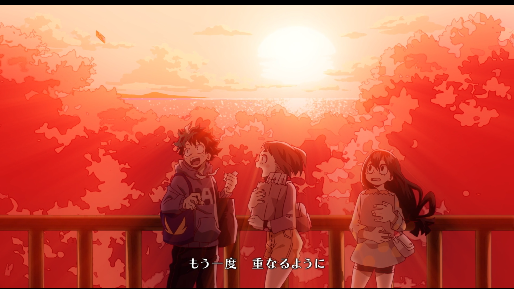

# test ⭐️
!헤드는 바꾸지 않아도 된다.1

!라인세퍼레이터


---
세퍼레이터는 개행---으로 바꿔준다. 위쪽 글자가 두꺼워져보이도록 바꾸는데 불필요하다.

볼드체
**Bear BOLD**는 ***GIT BOLD TALIC***로 바꿔주고
**합**
**내 껀 이것도 해준다!** gogo

/베어 이태릭/ 은
**깃 이태릭** 으로

/논
이테릭/

***언더라인***
***베어 언더라인*** → ****깃 언더라인**** ***베어 언더라인 두번째***

-스트라이크-
-베어 스트라이크- 는  ~~깃 스트라이크~~

* 불릿
	* 불릿2
		* 불릿3
		* 불릿3-1
"불릿은 \t * 으로 바꿔준다

1. 오더1
	1. 오더2
		1. 오더3

> 쿼트.. 이것이 인생
1
- 투두
+ 투두완료
이게 그냥 블릿으 처리되 아래와 같이 바꿔준다.

// -tab은
- [ ]
// +tab은
- [x]


`var a = 10;`


```json
{
  "cleanOutputDir": true,
  "exportTrash": false,
  "exportImages": true,
  "exportFiles": true,
  "outputDir": "*****~*****Bear Notes"
}
```

:: not marked String::
```diff
+ 순수 marked String
```

안녕하세요! 
```diff
+ marked String
```
 안녕하세요!

=>
```diff
+ marked String
```
그냥 이렇게 강제 개행시키고 기능을 지원하는게 좋겠다.

file
[💾myimsi.txt](https://github.com/HibikeQuantum/PlayGround/blob/master/Bear/files/5C01D883-4077-4954-8E28-B7C91ED285B7-67965-000005BA6002A679/myimsi.txt)
이런 패턴을 보면
[💾myimsi.txt](https://github.com/PlayGround/master/files/myimsi.txt)
이렇게 바꿔준다.


image


이런 텍스트가 보이면

이렇게 바꿔준다.
2
[image:001DC9A8-B6F9-4C3E-98E6-01BDDEA6AA83-76434-0000077576BE419E/
```diff
+ image
```
.png]

12

태그패턴 처리방법 정리
<!-- #welcome/Bear #test -->
1) 한덩이를 자르고 제일 마지막까지 ‘/‘으로 잘라서 nested한 구조로 저장한다.(+예상되는 URL도 쌍으로) 파싱과정에서 notag문서는 여기에 없다.
2) 이제 파싱을 시작한다. 이때는 이걸 만나면 찾아서 URL로 replace하면된다.
3) Navi.md 에선 가장 nested한 구조를 표현해서 링크를 표시한다.
4) 본문에선 아래와 같이 표현
[🔗welcom*****e*****Bear/Welcome***to***Bear.md)
4) URL은 부모면 내비게이트 md, 말단 노트 풀패스 md

<!-- {BearID:C026DB37-57BB-4D63-B26D-BF8F5AD21A84-67965-000005B4CA4ACA15} -->
